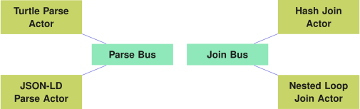
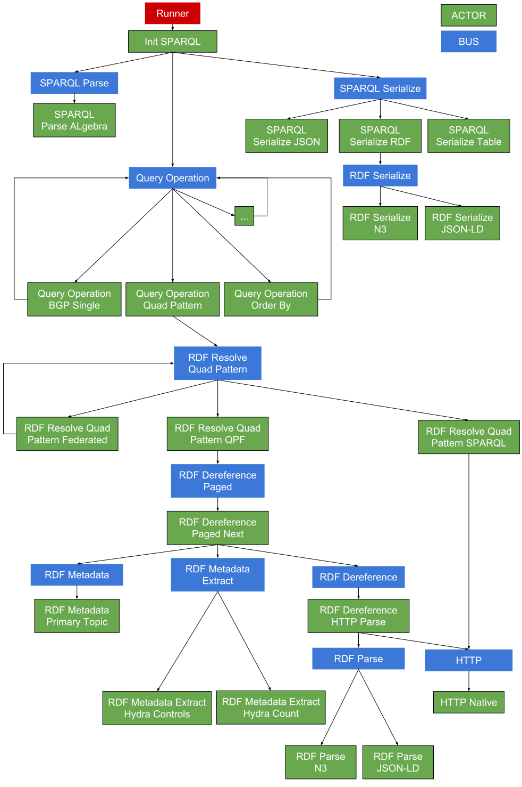

## Architecture
{:#architecture}

In this section, we discuss the design and architecture of the Comunica meta engine,
and show how it conforms to the _modularity_ feature requirement.
In summary, Comunica is collection of small modules that, when wired together,
are able to perform a certain task, such as evaluating SPARQL queries.
We first discuss the customizability of Comunica at design-time,
followed by the flexibility of Comunica at run-time.
Finally, we give an overview of all modules.

### Customizable Wiring at Design-time through Dependency Injection

There is no such thing as _the_ Comunica engine,
instead, Comunica is a meta engine that can be _instantiated_ into different engines based on different configurations.
Comunica achieves this customizability at design-time using the concept of [_dependency injection_](cite:cites DependencyInjection).
Using a configuration file, which is created before an engine is started,
components for an engine can be _selected_, _configured_ and _combined_.
For this, we use the [Components.js](cite:cites componentsjs) JavaScript dependency injection framework,
This framework is based on semantic module descriptions and configuration files
using the [Object-Oriented Components ontology](cite:cites vanherwegen_semsci_2017).

#### Description of Individual Software Components

In order to refer to Comunica components from within configuration files,
we semantically describe all Comunica components using the Components.js framework in [JSON-LD](cite:cites jsonld).
[](#config-actor) shows an example of the semantic description of an RDF parser.

#### Description of Complex Software Configurations

A specific instance of a Comunica engine
can be _initialized_ using Components.js configuration files
that describe the wiring between components.
For example, [](#config-parser) shows a configuration file of an engine that is able to parse N3 and JSON-LD-based documents.
This example shows that, due to its high degree of modularity,
Comunica can be used for other purposes than a query engine,
such as building a custom RDF parser.

Since many different configurations can be created,
it is important to know which one was used for a specific use case or evaluation.
For that purpose,
the RDF documents that are used to instantiate a Comunica engine
can be [published as Linked Data](cito:citeAsEvidence vanherwegen_semsci_2017).
They can then serve as provenance
and as the basis for derived set-ups or evaluations.

<figure id="config-actor" class="listing">
````/code/config-actor.json````
<figcaption markdown="block">
Semantic description of a component that is able to parse N3-based RDF serializations.
This component has a single parameter that allows media types to be registered that this parser is able to handle.
In this case, the component has four default media types.
</figcaption>
</figure>

<figure id="config-parser" class="listing">
````/code/config-parser.json````
<figcaption markdown="block">
Comunica configuration of `ActorInitRdfParse` for parsing an RDF document in an unknown serialization.
This actor is linked to a mediator with a bus containing two RDF parsers for specific serializations.
</figcaption>
</figure>

### Flexibility at Run-time using the Actor–Mediator–Bus Pattern

Once a Comunica engine has been configured and initialized,
components can interact with each other in a flexible way using the [_actor_](cite:cites actormodel),
[_mediator_](cite:cites mediatorpattern), and [_publish–subscribe_](cite:cites publishsubscribepattern) patterns.
Any number of _actor_, _mediator_ and _bus_ modules can be created,
where each actor interacts with mediators, that in turn invoke other actors that are registered to a certain bus.

[](#actor-mediator-bus) shows an example logic flow between actors through a mediator and a bus.
The relation between these components, their phases and the chaining of them will be explained hereafter.

<figure id="actor-mediator-bus">

<figcaption markdown="block">
Example logic flow where Actor 0 requires an _action_ to be performed.
This is done by sending the action to the Mediator, which sends a _test action_ to Actors 1, 2 and 3 via the Bus.
The Bus then sends all _test replies_ to the Mediator,
which chooses the best actor for the action, in this case Actor 3.
Finally, the Mediator sends the original action to Actor 3, and returns its response to Actor 0.
</figcaption>
</figure>

#### Relation between Actors and Buses

Actors are the main computational units in Comunica,
they are responsible for handling all the tasks and computations that need to be done.
These can range from simple jobs like executing a HTTP request 
to more complex functions such as solving a SPARQL query.
The main idea is that more complex actors can delegate some of their work to the simpler actors,
thereby reducing the implementation required and increasing the reuse of existing code.

Buses and mediators form the _glue_ that tie the actors together and makes them interactable.
Every actor subscribes to one or more buses,
which contain a collection of actors.
Actors are responsible for being able to accept certain messages via their bus(es),
and for responding with an answer.
[](#relation-actor-bus) shows an example of how actors can be registered to buses.

Initially we thought about having a single bus where all messages would be sent.
Every actor would then have to check every message to see if it applied to them.
This would have caused a drastic overhead though,
forcing many unnecessary checks from actors for unrelated messages.

In order to avoid this issue we created multiple buses
and actors are grouped together based on their functionality.
This greatly reduces the amount of unneeded message checks.
The groupings happen based on the functionality of the actors.
All actors that do transformations on bindings are grouped together for example,
the same for actors that handle metadata, and so on.
Note that these are the grouping that happen in the current existing implementations using Comunica.
Nothing is stopping a developer from creating a configuration that only makes use of a single bus.

<figure id="relation-actor-bus">

<figcaption markdown="block">
An example of two different buses each having two subscribed actors.
The left bus has different actors for parsing triples in a certain RDF serialization to triple objects.
The right bus has actors that join query bindings streams together in a certain way.
</figcaption>
</figure>

#### Mediators handle Actor Run and Test Phases

Each mediator is connected to a single bus, and its goal is to determine and invoke the *best* actor for a certain task.
The definition of '*best*' depends on the mediator, and different implementations can lead to different choices in different scenarios.
A mediator works in two phases: the _test_ phase and the _run_ phase.
The test phase is used to check under which conditions the action can be performed in each actor on the bus.
This phase must always come before the _run_ phase, and is used to select which actor is best suited to perform a certain task under certain conditions.
If such an actor is determined, the _run_ phase of a single actor is initiated.
This _run_ phase takes this same type of message, and requires to _effectively act_ on this message,
and return the result of this action.
[](#run-test-phases) shows an example of a mediator invoking a run and test phase.

<figure id="run-test-phases">

<figcaption markdown="block">
Example sequence diagram of a mediator that chooses the fastest actor
on a parse bus with two subscribed actors.
The first parser is very fast but requires a lot of memory,
while the second parser is slower, but requires less memory.
Which one is best, depends on the use case and is determined by the Mediator.
The mediator first calls the _tests_ the actors for the action, and then _runs_ the action using the _best_ actor.
</figcaption>
</figure>

It is up to the actors to provide a correct implementation of both the _test_ and _run_ functions.
The _run_ function is expected, it is the implementation of the actor's functionality.
The _test_ function might be harder on the other hand.
It consists of two steps:
first it has to determine whether it can actually act on the given input,
even though similar actors are grouped together
some of them might be more specific and not able to handle all kinds of input.
Secondly it has to return how much effort is required to execute this actor.
Since it is not always possible to predict the costs of executing the _run_ function,
this function will often rely on estimates.
Although there is nothing stopping an actor from lying about its functionality
and providing incorrect estimates once it has been included,
such actors should simply be removed again from the configuration.

Comunica does not enforce any other structure besides the actor model described above.
How this model gets implemented will depend on the developer.
In the actors we already provide we split up functionality as much as possible over multiple actors,
thereby increasing actor reuse and focussing each actor on their own separate task,
but on the complete other end of the spectrum it is possible to have an application with a single actor
that does all the work,
although this does lose the advantages of the actor model.
With the actors we already provide we try to guide developers to create irreducible actors,
but in the end there is flexibility there.

#### Executing a SPARQL query

Although Comunica is not a single engine,
we do provide some actors that have a preset configuration allowing users to immediately make use of its features.
The main actor there is [actor-init-sparql](https://github.com/comunica/comunica/tree/master/packages/actor-init-sparql),
which provides a configuration of actors allowing users to execute SPARQL over multiple heterogeneous sources.

[](#sparql-diagram) shows how an input query would be handled by that Comunica engine.
Firstly the query would be parsed and converted to SPARQL algebra,
which is how queries are represented internally.
That algebra then gets sent to the _Query Operation_ bus.
This is a collection of actors that each handle one specific algebra operation,
and recursively call the same bus again to solve the remaining algebra.
Once a quad pattern gets reached,
it gets sent to the _Quad Pattern Resolver_ bus.
Depending on the sources different actions are taken there.
If there are multiple sources,
these all get queried for results by recursively calling the same bus with the separate sources.
In the case of a TPF source the paginated data gets streamed
and the metadata extracted to finally reach the correct bindings,
while in the case of a SPARQL endpoint a new query gets composed to get the corresponding results.
These results then go all the way back up the stack of actors to be serialized in one of the available formats.


<figure id="sparql-diagram">

<figcaption markdown="block">
An overview of the the flow through the actors when executing a SPARQL query with Comunica.
</figcaption>
</figure>

### Modules

At the time of writing, Comunica consists of 118 different modules.
This consists of 17 buses, 5 mediator types, 83 actors and 13 other modules.
In this section, we will only discuss the most important actors and their interactions.

The main bus in Comunica is the _query operation_ bus, which consists of 34 different actors
that provide at least one possible implementation of the typical SPARQL operations such as quad patterns, basic graph patterns (BGPs), unions, projects, ...
These actors interact with each other using streams of _quad_ or _solution mappings_,
and act on a query plan expressed in in [SPARQL algebra](cite:cites spec:sparqllang).

In order to enable heterogeneous sources to be queried in a federated way,
we allow a list of sources, annotated by type, to be passed when a query is initiated.
These sources are passed down through the chain of query operation actors,
until the quad pattern level is reached.
At this level, different actors exist for handling a single source of a certain type,
such as TPF interfaces, SPARQL endpoints, local or remote data dumps.
In the case of multiple sources, one actor exists that implements a [federation algorithm defined for TPF](cite:cites ldf),
but instead of federating over different TPF interfaces, it federates over different single-source quad pattern actors.

At the end of the pipeline, different actors are available for serializing the results of a query in different ways.
For instance, there are actors for serializing the results according to
the SPARQL [JSON](cite:cites spec:sparqljson) and [XML](cite:cites spec:sparqlxml) result specifications,
but actors with more visual and developer-friendly formats are available as well.

### SPARQL Algebra
As mentioned before, internally Comunica converts SPARQL queries to
[SPARQL algebra](https://www.w3.org/TR/sparql11-query/#sparqlDefinition).
For this we make use of two parsers,
[one](https://github.com/RubenVerborgh/SPARQL.js) that first converts SPARQL strings to an custom JSON format,
and [another](https://github.com/joachimvh/SPARQLAlgebra.js) that converts that format 
to a JSON representation of SPARQL algebra.
The [representation](https://github.com/joachimvh/SPARQLAlgebra.js/blob/master/lib/algebra.ts)
is made to be as close to functions described in the specification as possible.

Using SPARQL algebra allows us to create actors
that focus on the core actions required to solve SPARQL queries,
without being too dependent on how the query was actually written.
For every algebra operation we have (at least) one actor that solves that specific operation
It also provides easier options to restructure and optimize the query before actual execution begins.

